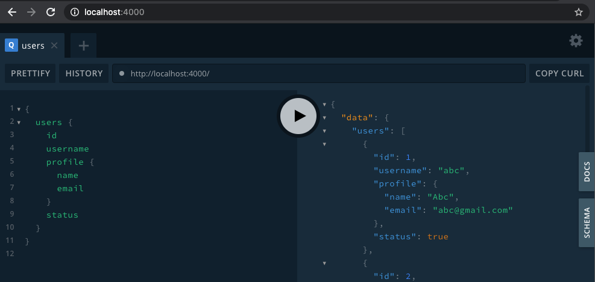

# grapql-server-complex-query-example

Example GraphQL Server for Complex Query

## Installation

Run on terminal

```sh
git clone https://github.com/hscstudio/grapql-server-complex-query-example.git
cd grapql-server-complex-query-example
npm install
npm run dev
```

You will see below on terminal

```
> nodemon index.js

[nodemon] 2.0.7
[nodemon] to restart at any time, enter `rs`
[nodemon] watching path(s): *.*
[nodemon] watching extensions: js,mjs,json
[nodemon] starting `node index.js`
🚀 Server ready at http://localhost:4000/
```

## Usage

Access GraphQL console `http://localhost:4000`

Input query:

```js
{
  users {
    id
    username
    profile {
      name
      email
    }
    status
  }
}
```

Click run



## Example Complex Query

### Where


Find users where username equal `def`

```js
{
  users(where: { username: { _eq: "def" } }) {
    id
    username
    profile {
      name
      email
    }
    status
  }
}
```

Result:

```
{
  "data": {
    "users": [
      {
        "id": 2,
        "username": "def",
        "profile": {
          "name": "Def",
          "email": "def@yahoo.com"
        },
        "status": true
      }
    ]
  }
}
```

Other query:
- `users(where: { profile__email: { _eq: "ghi@gmail.com" } })`
- `users(where: { profile__email: { _like: "gmail" } })`
- `products(where: { price: { _lte: 2000 } })`
